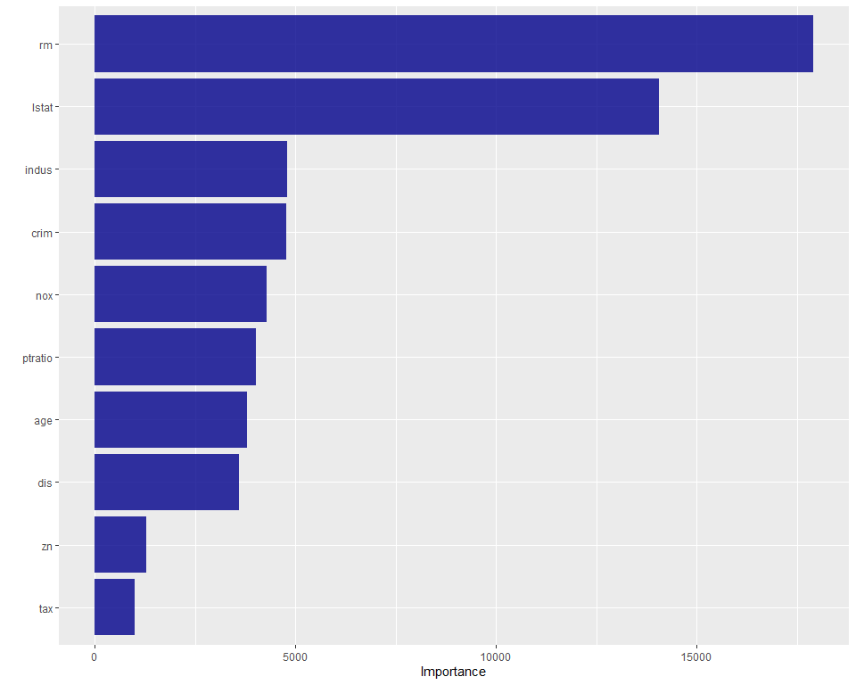

TUNANDO A ÁRVORE DE DECISÃO
================
Carlos Eduardo Cardoso
20/05/2021

# Como tunar um modelo de árvore de decisão

O objetivo desse trabalho é apresentar o passo a passo para construir um
modelo de árvore de decisão, com foco na tunagem dos hiperparâmetros
utilizando o tidymodels no R. A base de dados utilizada nessa análise
está presente no pacote *MASS* e traz informações sobre os valores de
residências no subúrbio de Boston. Para mais detalhes, carregue o pacote
*MASS*.

Essa base contém 506 linhas com 14 variáveis, cuja descrição pode ser
pesquisada em *?Boston*. Nosso trabalho consiste em construir um modelo
de árvore de decisão (regressão) para prever a variável *medv* (o valor
médio das casas ocupadas - em $1000)

Vamos carregar os pacotes necessários e a base de dados.

``` r
# Carregando os pacotes ---------------------------------------------------
library(vip)
library(tidymodels) # ML framework
library(knitr)
library(patchwork)
library(MASS)
library(dplyr)
library(skimr)
library(GGally)


# Carregando e entendo a base ---------------------------------------------
data("Boston")
knitr::kable(Boston[1:10,], 'markdown')
```

|    crim |   zn | indus | chas |   nox |    rm |   age |    dis | rad | tax | ptratio |  black | lstat | medv |
|--------:|-----:|------:|-----:|------:|------:|------:|-------:|----:|----:|--------:|-------:|------:|-----:|
| 0.00632 | 18.0 |  2.31 |    0 | 0.538 | 6.575 |  65.2 | 4.0900 |   1 | 296 |    15.3 | 396.90 |  4.98 | 24.0 |
| 0.02731 |  0.0 |  7.07 |    0 | 0.469 | 6.421 |  78.9 | 4.9671 |   2 | 242 |    17.8 | 396.90 |  9.14 | 21.6 |
| 0.02729 |  0.0 |  7.07 |    0 | 0.469 | 7.185 |  61.1 | 4.9671 |   2 | 242 |    17.8 | 392.83 |  4.03 | 34.7 |
| 0.03237 |  0.0 |  2.18 |    0 | 0.458 | 6.998 |  45.8 | 6.0622 |   3 | 222 |    18.7 | 394.63 |  2.94 | 33.4 |
| 0.06905 |  0.0 |  2.18 |    0 | 0.458 | 7.147 |  54.2 | 6.0622 |   3 | 222 |    18.7 | 396.90 |  5.33 | 36.2 |
| 0.02985 |  0.0 |  2.18 |    0 | 0.458 | 6.430 |  58.7 | 6.0622 |   3 | 222 |    18.7 | 394.12 |  5.21 | 28.7 |
| 0.08829 | 12.5 |  7.87 |    0 | 0.524 | 6.012 |  66.6 | 5.5605 |   5 | 311 |    15.2 | 395.60 | 12.43 | 22.9 |
| 0.14455 | 12.5 |  7.87 |    0 | 0.524 | 6.172 |  96.1 | 5.9505 |   5 | 311 |    15.2 | 396.90 | 19.15 | 27.1 |
| 0.21124 | 12.5 |  7.87 |    0 | 0.524 | 5.631 | 100.0 | 6.0821 |   5 | 311 |    15.2 | 386.63 | 29.93 | 16.5 |
| 0.17004 | 12.5 |  7.87 |    0 | 0.524 | 6.004 |  85.9 | 6.5921 |   5 | 311 |    15.2 | 386.71 | 17.10 | 18.9 |

``` r
# Variable description
# crim - per capita crime rate by town.
# zn - proportion of residential land zoned for lots over 25,000 sq.ft.
# indus - proportion of non-retail business acres per town.
# chas - Charles River dummy variable (= 1 if tract bounds river; 0 otherwise).
# nox - nitrogen oxides concentration (parts per 10 million).
# rm - average number of rooms per dwelling.
# age - proportion of owner-occupied units built prior to 1940.
# dis - weighted mean of distances to five Boston employment centres.
# rad - index of accessibility to radial highways.
# tax - full-value property-tax rate per \$10,000.
# ptratio - pupil-teacher ratio by town.
# black - 1000(Bk - 0.63)^2 where Bk is the proportion of blacks by town.
# lstat - lower status of the population (percent).
# medv - median value of owner-occupied homes in \$1000s.
```

# Breve análise exploratória dos dados

Vamos explorar um pouco dos nossos dados.

``` r
glimpse(Boston)
```

    ## Rows: 506
    ## Columns: 14
    ## $ crim    <dbl> 0.00632, 0.02731, 0.02729, 0.03237, 0.06905, 0.02985, 0.08829,~
    ## $ zn      <dbl> 18.0, 0.0, 0.0, 0.0, 0.0, 0.0, 12.5, 12.5, 12.5, 12.5, 12.5, 1~
    ## $ indus   <dbl> 2.31, 7.07, 7.07, 2.18, 2.18, 2.18, 7.87, 7.87, 7.87, 7.87, 7.~
    ## $ chas    <int> 0, 0, 0, 0, 0, 0, 0, 0, 0, 0, 0, 0, 0, 0, 0, 0, 0, 0, 0, 0, 0,~
    ## $ nox     <dbl> 0.538, 0.469, 0.469, 0.458, 0.458, 0.458, 0.524, 0.524, 0.524,~
    ## $ rm      <dbl> 6.575, 6.421, 7.185, 6.998, 7.147, 6.430, 6.012, 6.172, 5.631,~
    ## $ age     <dbl> 65.2, 78.9, 61.1, 45.8, 54.2, 58.7, 66.6, 96.1, 100.0, 85.9, 9~
    ## $ dis     <dbl> 4.0900, 4.9671, 4.9671, 6.0622, 6.0622, 6.0622, 5.5605, 5.9505~
    ## $ rad     <int> 1, 2, 2, 3, 3, 3, 5, 5, 5, 5, 5, 5, 5, 4, 4, 4, 4, 4, 4, 4, 4,~
    ## $ tax     <dbl> 296, 242, 242, 222, 222, 222, 311, 311, 311, 311, 311, 311, 31~
    ## $ ptratio <dbl> 15.3, 17.8, 17.8, 18.7, 18.7, 18.7, 15.2, 15.2, 15.2, 15.2, 15~
    ## $ black   <dbl> 396.90, 396.90, 392.83, 394.63, 396.90, 394.12, 395.60, 396.90~
    ## $ lstat   <dbl> 4.98, 9.14, 4.03, 2.94, 5.33, 5.21, 12.43, 19.15, 29.93, 17.10~
    ## $ medv    <dbl> 24.0, 21.6, 34.7, 33.4, 36.2, 28.7, 22.9, 27.1, 16.5, 18.9, 15~

``` r
skim(Boston)
```

|                                                  |        |
|:-------------------------------------------------|:-------|
| Name                                             | Boston |
| Number of rows                                   | 506    |
| Number of columns                                | 14     |
| \_\_\_\_\_\_\_\_\_\_\_\_\_\_\_\_\_\_\_\_\_\_\_   |        |
| Column type frequency:                           |        |
| numeric                                          | 14     |
| \_\_\_\_\_\_\_\_\_\_\_\_\_\_\_\_\_\_\_\_\_\_\_\_ |        |
| Group variables                                  | None   |

Data summary

**Variable type: numeric**

| skim\_variable | n\_missing | complete\_rate |   mean |     sd |     p0 |    p25 |    p50 |    p75 |   p100 | hist  |
|:---------------|-----------:|---------------:|-------:|-------:|-------:|-------:|-------:|-------:|-------:|:------|
| crim           |          0 |              1 |   3.61 |   8.60 |   0.01 |   0.08 |   0.26 |   3.68 |  88.98 | ▇▁▁▁▁ |
| zn             |          0 |              1 |  11.36 |  23.32 |   0.00 |   0.00 |   0.00 |  12.50 | 100.00 | ▇▁▁▁▁ |
| indus          |          0 |              1 |  11.14 |   6.86 |   0.46 |   5.19 |   9.69 |  18.10 |  27.74 | ▇▆▁▇▁ |
| chas           |          0 |              1 |   0.07 |   0.25 |   0.00 |   0.00 |   0.00 |   0.00 |   1.00 | ▇▁▁▁▁ |
| nox            |          0 |              1 |   0.55 |   0.12 |   0.38 |   0.45 |   0.54 |   0.62 |   0.87 | ▇▇▆▅▁ |
| rm             |          0 |              1 |   6.28 |   0.70 |   3.56 |   5.89 |   6.21 |   6.62 |   8.78 | ▁▂▇▂▁ |
| age            |          0 |              1 |  68.57 |  28.15 |   2.90 |  45.02 |  77.50 |  94.07 | 100.00 | ▂▂▂▃▇ |
| dis            |          0 |              1 |   3.80 |   2.11 |   1.13 |   2.10 |   3.21 |   5.19 |  12.13 | ▇▅▂▁▁ |
| rad            |          0 |              1 |   9.55 |   8.71 |   1.00 |   4.00 |   5.00 |  24.00 |  24.00 | ▇▂▁▁▃ |
| tax            |          0 |              1 | 408.24 | 168.54 | 187.00 | 279.00 | 330.00 | 666.00 | 711.00 | ▇▇▃▁▇ |
| ptratio        |          0 |              1 |  18.46 |   2.16 |  12.60 |  17.40 |  19.05 |  20.20 |  22.00 | ▁▃▅▅▇ |
| black          |          0 |              1 | 356.67 |  91.29 |   0.32 | 375.38 | 391.44 | 396.22 | 396.90 | ▁▁▁▁▇ |
| lstat          |          0 |              1 |  12.65 |   7.14 |   1.73 |   6.95 |  11.36 |  16.96 |  37.97 | ▇▇▅▂▁ |
| medv           |          0 |              1 |  22.53 |   9.20 |   5.00 |  17.02 |  21.20 |  25.00 |  50.00 | ▂▇▅▁▁ |

Todas as variáveis são numéricas, algumas bastante assimétricas, como
por exemplo, *age* que representa a porporção de unidades ocupadas pelo
proprietário e *rad* que mostra o índice de acessibilidade a rodovias.
Já a variável *rm* (número médio de cômodos) parece estar mais
equilibrada. Não há dados faltantes.

A variável *chas* é uma variável Dummy que indica 1 se a área do imóvel
limita o rio e 0 caso contrário. Vamos analisar o comportamento das
outras variáveis em relação a ela e construir a matriz de correlação
para analisar o comportamento da nossa variável resposta *medv* em
relação as demais.

``` r
ggpairs(Boston,
        title="Boston", 
        colour = "am", ggplot2::aes(colour=as.factor(chas)),
        lower = list(continuous = "smooth"))
```

<!-- -->

``` r
ggcorr(Boston, label = T)
```

<!-- -->

Verifica-se alguma correlação da variável *medv* com praticamente todas
as outras variáveis, sendo que existem outras que também se
correlacionam entre si. Em relação a variável *chas* não há, pelo menos
visualmente, uma diferencição tão forte assim.

# Modelagem

Nosso foco é construir um modelo de árvore de decisão e mostrar uma
forma de se realizar a tunagem dos hiperparâmetros. Para tal,
utilizaremos todas as outras variáveis como preditoras, visto que, esse
tipo de modelo se comporta bem em situações de multicolinearidade.

## Passo 1:

``` r
# Base de treino e teste --------------------------------------------------
set.seed(1)
boston_split = initial_split(Boston)

boston_train = training(boston_split)
boston_test = testing(boston_split)
```

O primeiro passo consiste em dividir nossos dados em treino e teste.
Consideraremos 75% para treino e 25% para teste (por default, a função
*initial\_split* já considera essa proporção).

Em seguida vamos definir as especificações do modelo, passando os
hiperparâmetros (*cost\_complexity*, *min\_n*, *tree\_depth*). A função
tune() é quem permite a tunagem desses valores e isso será realizado no
passo seguinte (Passo 3). Construiremos um modelo de regressão (definido
no *set\_mode*) com o pacote *rpart* (definido no *set\_engine*).

## Passo 2

``` r
# ESQUELETO DO MODELO - ÁRVORE DE DECISÃO ---------------------------------
boston_arvore = decision_tree(
  cost_complexity = tune(),
  min_n = tune(),
  tree_depth = tune()
)%>%
  set_engine('rpart')%>%
  set_mode('regression')
boston_arvore
```

    ## Decision Tree Model Specification (regression)
    ## 
    ## Main Arguments:
    ##   cost_complexity = tune()
    ##   tree_depth = tune()
    ##   min_n = tune()
    ## 
    ## Computational engine: rpart

## Passo 3:

Chegou o momento da tunagem dos hiperparâmetros. Para tal utilizaremos
uma validação cruzada com k=5. Com a função *grid\_regular* criamos as
grades para os hiperparâmetros e definimos em *levels* quantos valores
serão testados para cada um deles, podendo ser um único inteiro ou um
vetor de inteiros.

``` r
# CROSS VALIDATION --------------------------------------------------------
boston_resample = vfold_cv(boston_train, v=5)


# Tunando os hiperparâmetros ----------------------------------------------
arvore_grid = grid_regular(cost_complexity(), tree_depth(), min_n(), levels=4)

boston_tune_grid = tune_grid(
  boston_arvore,
  medv~.,
  resamples = boston_resample,
  grid = arvore_grid,
  metrics = metric_set(rmse, rsq, mae, mape),
  control = control_grid(verbose = TRUE, allow_par = FALSE))

boston_tune_grid
```

    ## # Tuning results
    ## # 5-fold cross-validation 
    ## # A tibble: 5 x 4
    ##   splits           id    .metrics           .notes          
    ##   <list>           <chr> <list>             <list>          
    ## 1 <split [304/76]> Fold1 <tibble [256 x 7]> <tibble [0 x 1]>
    ## 2 <split [304/76]> Fold2 <tibble [256 x 7]> <tibble [0 x 1]>
    ## 3 <split [304/76]> Fold3 <tibble [256 x 7]> <tibble [0 x 1]>
    ## 4 <split [304/76]> Fold4 <tibble [256 x 7]> <tibble [0 x 1]>
    ## 5 <split [304/76]> Fold5 <tibble [256 x 7]> <tibble [0 x 1]>

No passo 4 podemos verificar o comportamento do modelo com os diferentes
valores dos hiperparâmetros testados com a função *autoplot* e coletar
as métricas para análise de desempenho com a função *colect\_metrics*.

## Passo 4:

``` r
# Verificando os resultados da tunagem ------------------------------------
autoplot(boston_tune_grid)+theme_light(base_family = "IBMPlexSans")
```

<!-- -->

``` r
collect_metrics(boston_tune_grid)%>%
  arrange(tree_depth)
```

    ## # A tibble: 256 x 9
    ##    cost_complexity tree_depth min_n .metric .estimator   mean     n std_err
    ##              <dbl>      <int> <int> <chr>   <chr>       <dbl> <int>   <dbl>
    ##  1    0.0000000001          1     2 mae     standard    5.65      5  0.158 
    ##  2    0.0000000001          1     2 mape    standard   29.7       5  2.65  
    ##  3    0.0000000001          1     2 rmse    standard    7.63      5  0.134 
    ##  4    0.0000000001          1     2 rsq     standard    0.364     5  0.0197
    ##  5    0.0000001             1     2 mae     standard    5.65      5  0.158 
    ##  6    0.0000001             1     2 mape    standard   29.7       5  2.65  
    ##  7    0.0000001             1     2 rmse    standard    7.63      5  0.134 
    ##  8    0.0000001             1     2 rsq     standard    0.364     5  0.0197
    ##  9    0.0001                1     2 mae     standard    5.65      5  0.158 
    ## 10    0.0001                1     2 mape    standard   29.7       5  2.65  
    ## # ... with 246 more rows, and 1 more variable: .config <chr>

A função *show\_best* permite verificar os melhores hiperparâmetros a
partir de uma métrica escolhida, no nosso caso olhamos para o *RMSE*. Em
seguida selecionamos os melhores hiperparâmetros com a função
*select\_best* e utilizamos *finalize\_model* para colocar esses
melhores valores em nosso modelo, conforme mostra o Passo 5.

## Passo 5:

``` r
# Selecionando o melhor valor para o hiperparâmetro ajustado --------------
show_best(boston_tune_grid, 'rmse')
```

    ## # A tibble: 5 x 9
    ##   cost_complexity tree_depth min_n .metric .estimator  mean     n std_err
    ##             <dbl>      <int> <int> <chr>   <chr>      <dbl> <int>   <dbl>
    ## 1    0.0000000001         10    27 rmse    standard    4.57     5   0.513
    ## 2    0.0000001            10    27 rmse    standard    4.57     5   0.513
    ## 3    0.0001               10    27 rmse    standard    4.57     5   0.513
    ## 4    0.0000000001         15    27 rmse    standard    4.57     5   0.513
    ## 5    0.0000001            15    27 rmse    standard    4.57     5   0.513
    ## # ... with 1 more variable: .config <chr>

``` r
boston_best_hiper = select_best(boston_tune_grid, 'rmse')
boston_arvore_final = boston_arvore%>%
  finalize_model(boston_best_hiper)
```

## Passo 6:

Após a escolha dos melhores hiperparâmetros, usamos a função *last\_fit*
e aplicamos nas definições do modelo construído, indicando a variável
resposta e as variáveis preditoras bem como os dados. Em seguida
coletamos as métricas de teste e verificamos as predições.

``` r
# Analisando o desempenho do modelo final ---------------------------------
boston_arvore_final_fit = boston_arvore_final%>%
  last_fit(medv~., split = boston_split)

collect_metrics(boston_arvore_final_fit)
```

    ## # A tibble: 2 x 4
    ##   .metric .estimator .estimate .config             
    ##   <chr>   <chr>          <dbl> <chr>               
    ## 1 rmse    standard       4.16  Preprocessor1_Model1
    ## 2 rsq     standard       0.772 Preprocessor1_Model1

``` r
collect_predictions(boston_arvore_final_fit)
```

    ## # A tibble: 126 x 5
    ##    id               .pred  .row  medv .config             
    ##    <chr>            <dbl> <int> <dbl> <chr>               
    ##  1 train/test split  21.3    13  21.7 Preprocessor1_Model1
    ##  2 train/test split  20.5    14  20.4 Preprocessor1_Model1
    ##  3 train/test split  21.7    20  18.2 Preprocessor1_Model1
    ##  4 train/test split  20.5    22  19.6 Preprocessor1_Model1
    ##  5 train/test split  14.1    24  14.5 Preprocessor1_Model1
    ##  6 train/test split  14.1    25  15.6 Preprocessor1_Model1
    ##  7 train/test split  20.5    29  18.4 Preprocessor1_Model1
    ##  8 train/test split  14.1    33  13.2 Preprocessor1_Model1
    ##  9 train/test split  23.1    37  20   Preprocessor1_Model1
    ## 10 train/test split  23.1    39  24.7 Preprocessor1_Model1
    ## # ... with 116 more rows

``` r
#plotando:
collect_predictions(boston_arvore_final_fit)%>%
  ggplot(aes(x=c(1:126)))+
  geom_point(aes(y=medv), color = "red", stroke=2)+
  geom_line(aes(y=medv),color = 'red')+
  geom_point(aes(y=.pred), color='black', stroke=2)+
  geom_line(aes(y=.pred), color = 'black')+
  xlab('')+
  ylab('medv')+
  ggtitle('Comparativo entre os valores reais (vermelho) e os previstos (preto)')
```

<!-- -->

``` r
boston_arvore_final_fit %>%
  collect_predictions() %>%
  ggplot(aes(medv, .pred)) +
  geom_abline(slope = 1, lty = 2, color = "gray50", alpha = 0.6) +
  geom_point(alpha = 0.7, color = "darkblue") +
  coord_fixed()
```

<!-- -->

Finalizamos mostrando uma importante função do pacote *vip* que permite
verificar quais variáveis tem maior impacto no modelo.

``` r
# Importância das variáveis -----------------------------------------------
library(vip)
boston_arvore_final_fit$.workflow[[1]]$fit$fit%>%
  vip(geom = 'col',aesthetics = list(fill = "darkblue", alpha = 0.8))
```

<!-- -->
